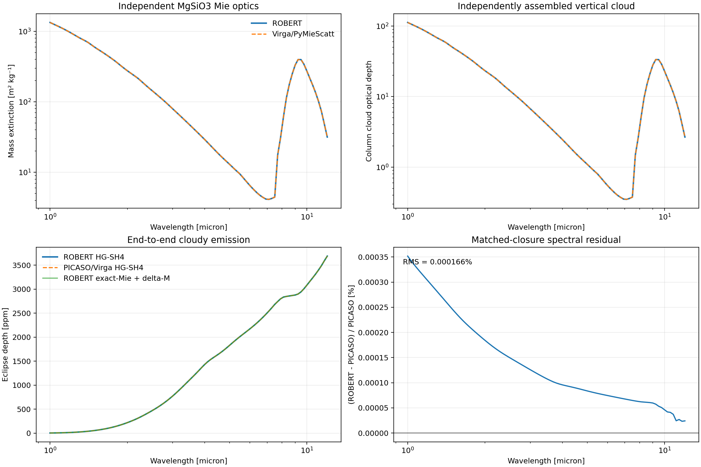

# End-to-End PICASO/Virga Cloud Parity

Date: 2026-07-13

## Result

ROBERT and PICASO/Virga independently reproduce the final matched-closure
cloudy emission spectrum to **1.66e-6 RMS relative difference** and **3.52e-6
maximum relative difference**. The independently calculated MgSiO3 mass
extinction agrees to **1.60e-6 RMS**, and the maximum difference in the cloud's
effect on eclipse depth is **0.00115 ppm**. All predeclared acceptance gates
pass.



This closes the previous shared-optical-depth limitation. Neither framework
receives gas or cloud optical depth from the other. They receive only one
physical contract and independently calculate:

1. state-dependent validation gas opacity and layer gas optical depth;
2. spherical-particle Mie extinction, scattering, and asymmetry;
3. integration over the shared particle population;
4. hydrostatic cloud optical depth from the shared condensate profile; and
5. four-stream SH thermal emission and eclipse depth.

The matched comparison uses the four-term Henyey-Greenstein phase closure with
delta-M disabled because this is the highest common cloud phase representation
available in the installed PICASO/Virga interface. A second ROBERT result uses
its native exact Mie moments and degree-four delta-M scaling to quantify the
closure choice separately from framework parity.

## Shared physical contract

| Quantity | Value |
| --- | --- |
| Atmosphere | 72 layers, `1e-5` to 10 bar, 780 to 1600 K |
| Gravity | 8.42 m s-2 |
| Spectral grid | 96 logarithmic points, 1 to 12 micron |
| Gas state | H2O, CO, CO2, and CH4 layer mass fractions |
| Cloud material | glassy MgSiO3, Dorschner et al. (1995) |
| Refractive-index checksum | `0faef18dbd1ae853ef25be2f2766f499f9cb37d0732e0f401ca86e999c30c731` |
| Particle population | 36-bin discretized lognormal number distribution |
| Effective radius | 0.300 micron |
| Geometric standard deviation | 1.6 |
| Particle density | 3200 kg m-3 |
| Peak condensate mass fraction | `1.20e-5` |
| Disk integration | six emission-angle ordinates |

The pressure-temperature structure and body values are representative of the
WASP-69b validation target. The condensate profile is prescribed rather than
generated by Ackerman-Marley microphysics so that the benchmark tests optical
physics without conflating different cloud-formation models.

The reference gas mass fractions are `8e-4` H2O, `3e-4` CO, `2e-5` CO2, and
`4e-6` CH4; H2O has a weak `pressure^0.025` validation gradient. The cloud
profile is log-Gaussian in pressure, centered near 0.02 bar with a width of
0.85 dex and a peak condensate mass fraction of `1.2e-5`. Exact arrays are in
the checksum-pinned physical-contract archive.

The gas opacity is an explicitly labeled smooth analytic validation fixture.
It depends on pressure, temperature, composition, and wavelength and is
implemented separately in the ROBERT and external runners. It is not a
retrieval opacity or a replacement for line-by-line/correlated-k physics. This
choice was necessary because the local PICASO 3.2.2 installation's official
7 GB molecular database is represented only by zero-byte Dropbox placeholders.
Using a validation opacity preserves the strict no-shared-tau contract without
silently substituting a ROBERT opacity inside PICASO.

## Independent implementations

The ROBERT process uses `robert_exoplanets.mie_efficiencies`, independently
integrates the discrete population, constructs gas and cloud optical depths,
and calls `solve_thermal_sh4`.

The external Python 3.10 process uses Virga's
`calc_mie.calc_new_mieff`/PyMieScatt path, independently integrates the same
population, constructs its own gas and cloud optical depths, and calls
PICASO's `fluxes.get_thermal_SH` with four streams. The installed distribution
versions report PICASO 3.2.2 and Virga 0.4.

The only shared file is the physical contract. It contains wavelength, n and
k, particle-bin coordinates and number weights, pressure and temperature,
gas mass fractions, condensate mass fraction, gravity, disk geometry, and body
parameters. It contains no gas tau, cloud tau, Mie efficiency, albedo,
asymmetry, phase moment, or spectrum.

## Accuracy decomposition

| Boundary | RMS difference | Maximum difference |
| --- | ---: | ---: |
| Mie `Qext`, relative | 0.0257% | 0.267% |
| Mie `Qsca`, relative | 0.00855% | 0.111% |
| Population mass extinction, relative | 0.000160% | 0.000822% |
| Single-scattering albedo, absolute | `5.21e-8` | `3.29e-7` |
| Asymmetry factor, absolute | `1.82e-9` | `1.19e-8` |
| Independently assembled gas tau, relative | `6.00e-16` | `2.49e-15` |
| Independently assembled cloud tau, relative | `1.60e-6` | `8.22e-6` |
| Clear SH4 disk spectrum, relative | `1.62e-6` | `3.34e-6` |
| Cloudy HG-SH4 disk spectrum, relative | `1.66e-6` | `3.52e-6` |
| Cloudy eclipse depth, absolute | 0.00113 ppm | 0.00176 ppm |
| Cloud effect on eclipse depth, absolute | 0.000278 ppm | 0.00115 ppm |

The cloud changes the eclipse spectrum by as much as 472.11 ppm in both
frameworks, so the agreement is not a trivial optically negligible limit.

The largest individual Mie-efficiency relative errors occur where the
efficiency is extremely small. Population integration suppresses those cells,
which is why the physically used mass extinction is substantially more stable.

ROBERT's native exact-Mie-moment plus delta-M spectrum differs from PICASO's
Henyey-Greenstein result by 0.0397% RMS and 0.0750% maximum. This is a phase
closure difference, not a framework implementation residual, and is small for
the 0.3-micron population tested here. It should be recomputed for larger and
more strongly forward-scattering particles.

## Resolution convergence

All convergence cases independently reran both frameworks. Framework parity
remained essentially fixed at 1.66e-6 RMS in every case.

### Particle-radius grid

Relative to the 36-bin baseline:

| Radius bins | ROBERT RMS / max | PICASO/Virga RMS / max |
| ---: | ---: | ---: |
| 24 | 0.0755% / 0.290% | 0.0755% / 0.290% |
| 48 | 0.0384% / 0.217% | 0.0384% / 0.217% |

The equal changes in both frameworks demonstrate convergence of the shared
particle discretization rather than compensating code errors.

### Vertical grid

Relative to the 72-layer baseline:

| Layers | ROBERT RMS / max | PICASO/Virga RMS / max |
| ---: | ---: | ---: |
| 36 | 0.132% / 0.209% | 0.132% / 0.209% |
| 144 | 0.0331% / 0.0525% | 0.0331% / 0.0525% |

### Spectral grid

After log-wavelength interpolation onto the 192-point reference grid:

| Wavelength points | ROBERT RMS / max | PICASO/Virga RMS / max |
| ---: | ---: | ---: |
| 48 | 0.325% / 1.92% | 0.325% / 1.92% |
| 96 | 0.0800% / 0.491% | 0.0800% / 0.491% |

For paper spectra, use at least the 96-point fixture and preferably the native
instrument/opacity grid. The 48-point result is adequate for code smoke tests,
not for resolving the 10-micron silicate structure.

## Acceptance gates

The versioned report enforces:

- independently assembled gas tau maximum relative difference below `1e-12`;
- population mass-extinction RMS relative difference below 2%;
- final cloudy disk-spectrum RMS relative difference below 1%; and
- cloud-effect maximum eclipse-depth disagreement below 10 ppm.

The measured result passes these thresholds by large margins. The generous
release gates protect against cross-platform/library variation; the measured
values should be monitored for drift rather than treated as the permitted
target accuracy.

## Reproduction

Run the ROBERT harness from the required environment. It invokes the isolated
external PICASO/Virga runner itself:

```bash
conda run -p /Users/jaketaylor/miniforge3/envs/robert-exoplanets \
  python examples/benchmark_end_to_end_cloud_parity.py \
  --picaso-python /Users/jaketaylor/opt/anaconda3/envs/picaso/bin/python
```

The harness writes the shared contract, both independent intermediate outputs,
the JSON report, and the four-panel diagnostic figure. The external runner
imports no ROBERT modules.

## Science-opacity extension

This benchmark validates end-to-end cloud optics and cloudy thermal RT from
physical inputs. The former molecular-opacity boundary is now addressed by
`docs/review/36_official_picaso_molecular_cloud_parity.md`, which uses the
official R=15,000 PICASO database, ROBERT's independent ExoMolOP/CIA path,
species-resolved molecular optical depths, and both emission and transmission.

For the paper, report the matched-closure result as the code-parity validation
and the official-database extension as an opacity-systematics validation. Do
not present the analytic gas bands as a molecular-opacity validation.
