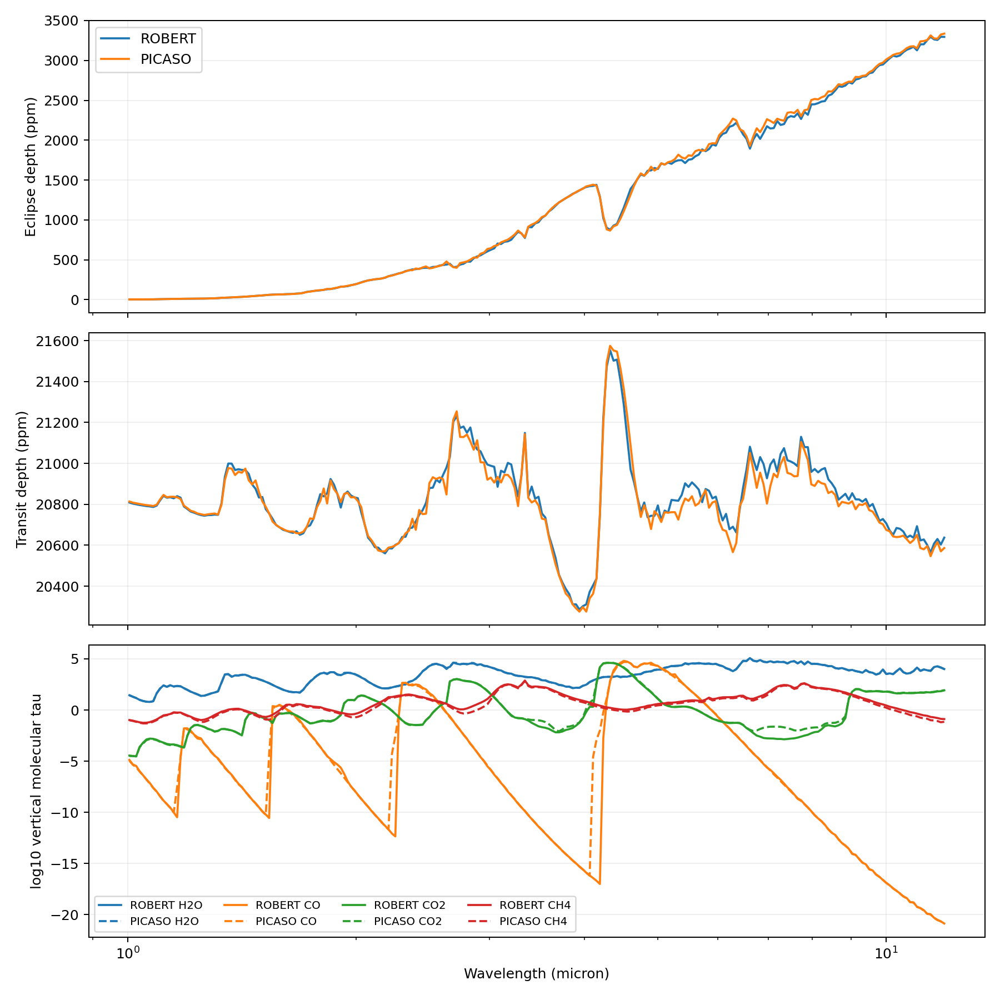

# Official PICASO Molecular-Opacity Cloud Benchmark

Date: 2026-07-13

## Result

The full native PICASO R=15,000 opacity database has now been evaluated in the
same end-to-end MgSiO3 cloud experiment as ROBERT's independent ExoMolOP
opacity-sampling path. The calculation includes both thermal emission and
transmission, clear and cloudy cases, species-resolved molecular optical depth,
CIA, Rayleigh extinction, independently calculated Mie optics, and independently
assembled cloud optical depth.

At the paper output resolution (240 logarithmic bins from 1-12 micron, R about
97), the independent databases and solvers differ by:

| Observable | Clear RMS | Cloudy RMS | Cloud-effect disagreement RMS |
| --- | ---: | ---: | ---: |
| Eclipse depth | 30.95 ppm | 27.44 ppm | 7.89 ppm |
| Transit depth | 49.14 ppm | 40.60 ppm | 17.84 ppm |

The independently calculated cloud mass extinction still agrees to
**1.58e-6 RMS relative difference** (maximum `8.22e-6`). This reproduces the
cloud-only parity result while replacing the analytic validation gas opacity
with two real, separately sourced molecular databases.



These spectral residuals are not treated as code-parity failures. The
calculation intentionally compares different opacity databases and, for some
molecules, different line lists. They measure a realistic opacity-systematic
floor for this physical state.

## Official PICASO database provenance

The PICASO database is the February 2025 Zenodo release:

- DOI: `10.5281/zenodo.14861730`;
- archive: `opacities_0.3_15_R15000.db.tar.gz`;
- published archive MD5: `2f003f823d5f4b3f7a206d0ece9874b1`;
- extracted SQLite size: 7,344,152,576 bytes;
- extracted SHA-256:
  `93696f7b17a90503b91404a0bbb9e27f1f8bc29e23c8c4bf3dac115d84b3aa09`;
- database metadata: `default_3.3`, R=15,000, 0.3-15 micron;
- 1,460 pressure-temperature grid points and ten molecular species.

The installed external runner is PICASO 3.2.2 with Virga 0.4. It uses the
matching v3.2 reference assets and passes the 2025 database explicitly to
`opannection`; the opacity schema is compatible. The external process imports
no ROBERT module.

The full 7.34 GB database is ignored by Git and is not part of the versioned
fixture. The compact report pins the database cryptographically.

## Shared physical contract

The shared inputs are the same cloud experiment used in the analytic-opacity
parity benchmark:

- 72 layers from `1e-5` to 10 bar and 780-1600 K;
- reference gravity 8.42 m s-2 at the 10-bar reference radius, with
  inverse-square gravity above it;
- H2O, CO, CO2, and CH4 volume-mixing-ratio profiles;
- H2 volume mixing ratio 0.84 with He filling the remaining abundance;
- measured Dorschner et al. MgSiO3 refractive indices;
- a 36-bin lognormal particle distribution with 0.300 micron effective radius
  and geometric standard deviation 1.6;
- the same prescribed vertical condensate profile, particle density, planet
  radius, stellar radius, and stellar temperature.

Only state and material inputs are shared. Molecular opacity, CIA opacity, Mie
efficiencies, gas optical depth, cloud optical depth, and spectra are not.

## Reference-radius audit

The original transmission comparison contained a nearly systematic offset:
ROBERT minus PICASO averaged about -195 ppm in the clear case and -224 ppm in
the cloudy case. Both codes were confirmed to place the supplied
75,567,044 m radius at exactly 10 bar, so the reference pressure itself was not
misassigned.

The mismatch was in the pressure-radius mapping above that anchor. PICASO uses
inverse-square gravity derived from the supplied mass and radius, giving an
8,093.094 km column between 10 bar and `1e-5` bar. The initial ROBERT benchmark
held gravity fixed at 8.42 m s-2 and produced only 7,287.205 km. The corrected
ROBERT benchmark independently integrates the same inverse-square physical
convention for both gas column densities and spherical path geometry. Its top
radius is 83,659,371.93 m versus PICASO's 83,660,138.49 m, a 0.767 km difference
over the full six-decade pressure column. Both bottom radii remain exactly
75,567,044 m at 10 bar.

After this correction, the clear and cloudy transit-depth RMS residuals fall
to 49.14 and 40.60 ppm. Their medians are +27.86 and +12.94 ppm, respectively,
so the former one-sided systematic offset is removed; the remaining residuals
change sign with wavelength and track independent opacity, CIA/Rayleigh, and
slant-integration differences.

ROBERT evaluates ExoMolOP tables for POKAZATEL H2O, Li2015 CO, UCL-4000 CO2,
and YT34to10 CH4, plus the vendored NemesisPy/HITRAN-2012 CIA table. PICASO
queries its official molecular and continuum tables. The ROBERT CO2 source file
contains the invalid embedded DOI string `qqq`; the benchmark retains that fact
in provenance and supplies the independently verified UCL-4000 DOI
`10.1093/mnras/staa1874`.

## Molecular optical-depth decomposition

The species-resolved, vertically integrated optical depths differ as follows:

| Species | RMS log10 tau difference | Median log10 ratio | Maximum absolute |
| --- | ---: | ---: | ---: |
| H2O | 0.0182 dex | +0.00322 dex | 0.0895 dex |
| CO | 1.789 dex | +0.0107 dex | 14.99 dex |
| CO2 | 0.2778 dex | -0.0206 dex | 1.200 dex |
| CH4 | 0.1808 dex | +0.1140 dex | 0.555 dex |

H2O agrees remarkably well after R~97 integration. CH4 and CO2 show
scientifically material band differences. The CO RMS is dominated by a few
windows where the Li2015 ExoMolOP table is effectively transparent but the
PICASO database retains opacity, especially near 4.11-4.24 and 2.23-2.25
micron. The median CO ratio is close to unity; therefore the 1.79 dex RMS must
not be summarized as a global abundance-scale offset.

## Cloud effect with independent gas backgrounds

The cloud changes ROBERT emission by 82.68 ppm RMS and PICASO emission by
88.81 ppm RMS. Their cloud-effect spectra differ by 7.89 ppm RMS and 27.21 ppm
maximum. This is larger than the 0.001 ppm matched-opacity cloud-parity result
because different gas optical depths move the thermal photosphere relative to
the same cloud deck.

For transmission, the cloud effect is 386.48 ppm RMS in ROBERT and 394.99 ppm
RMS in PICASO. The cloud-effect disagreement is 17.84 ppm RMS and 78.88 ppm
maximum. With the hydrostatic pressure-radius mapping aligned, the remaining
cloud-effect residual is spectrally structured rather than a reference-radius
offset.

## Opacity-sampling convergence

All paper numbers above use every native opacity sample: 37,275 ROBERT samples
and 37,273 PICASO samples from 1-12 micron. Coarser database strides were run
through both full forward models and then binned to the same R~97 output grid.

RMS differences relative to the full native calculation are:

| Stride | Effective opacity R | ROBERT cloudy emission | PICASO cloudy emission | ROBERT cloudy transmission | PICASO cloudy transmission |
| ---: | ---: | ---: | ---: | ---: | ---: |
| 2 | 7,500 | 16.80 ppm | 15.95 ppm | 24.25 ppm | 22.39 ppm |
| 5 | 3,000 | 31.71 ppm | 31.76 ppm | 47.87 ppm | 48.41 ppm |

This is a key negative result: simply retaining an apparently high effective
opacity resolution is not sufficient for ppm-level R~100 spectra when samples
are selected by stride. The paper benchmark must use the full R=15,000 grid or
a validated flux-conserving opacity-resampling method. Stride 2 and stride 5
are appropriate only for smoke and performance tests.

## Acceptance and interpretation

The regression gates verify that:

- the exact official database size and cryptographic identity are present;
- every molecular, emission, and transmission output is finite;
- independently calculated cloud mass extinction agrees below `2e-5` RMS;
- the versioned full-native reference and convergence files are intact.

Spectral agreement is deliberately not an acceptance gate. Treating
cross-database residuals as a pass/fail code check would hide the scientific
question this benchmark is designed to expose.

The current result supports science use with two explicit qualifications:

1. paper spectra must use the full native opacity grids; and
2. retrieval conclusions should be repeated across the ROBERT ExoMolOP and
   official PICASO opacity families, particularly when CO, CO2, or CH4 drives
   the inference.

## Reproduction

Download the official PICASO archive into the ignored opacity directory and
verify its published checksum. Then run the harness from the required ROBERT
environment; it invokes the isolated PICASO environment itself:

```bash
conda run -p /Users/jaketaylor/miniforge3/envs/robert-exoplanets \
  python examples/benchmark_official_picaso_molecular_cloud_parity.py \
  --picaso-python /Users/jaketaylor/opt/anaconda3/envs/picaso/bin/python \
  --opacity-stride 1
```

Native contract and PICASO arrays are held in a temporary directory during the
run. Only the compact R~97 arrays, provenance report, convergence report,
diagnostic figure, and checksums are versioned.
