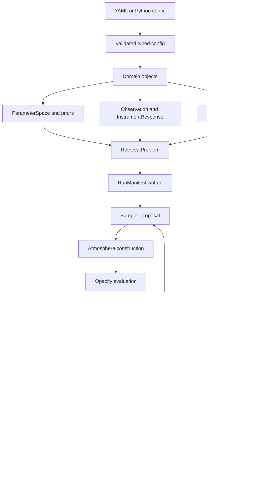

# RFC-0001: ROBERT Architectural Specification

Status: draft for review.

Applies to: all future ROBERT development.

Distribution name: `robert-exoplanets`.

Import namespace target: `robert_exoplanets`.

## 1. Purpose

ROBERT is a scientific platform for atmospheric retrieval of exoplanet spectra,
with an initial focus on JWST emission retrievals. This RFC defines the
architectural rules that every substantial contribution must follow.

The goal is not to create the most feature-rich retrieval code. The goal is to
create a retrieval framework that stays scientifically trustworthy,
understandable, extensible, and maintainable for the next decade.

This RFC is informed by reviews of NEMESIS, NemesisPy, TauREx, POSEIDON,
petitRADTRANS, PICASO, CHIMERA, Brewster, and Exo_Skryer.

## 2. Normative Companion Documents

RFC-0001 is the entry point. The detailed implementation rules live in these
companion documents:

| Document | Purpose |
| --- | --- |
| [Software Architecture Document](../architecture/software_architecture_document.md) | Package boundaries, dependencies, and module ownership. |
| [Scientific Data Model Specification](../architecture/scientific_data_model_specification.md) | Core scientific entities and lifecycles. |
| [Interface Specification](../architecture/interface_specification.md) | Stable protocols for pluggable components. |
| [Repository Structure Guide](../architecture/repository_structure_guide.md) | Repository layout and directory responsibilities. |
| [Developer Guidelines](../architecture/developer_guidelines.md) | Contribution rules and code style. |
| [Testing & Validation Guide](../architecture/testing_validation_guide.md) | Test tiers and scientific validation. |
| [Performance Strategy](../architecture/performance_strategy.md) | Optimization rules and backend strategy. |
| [Development Roadmap](../architecture/development_roadmap.md) | Versioned path from v0.1 to v1.0. |

The previous single-file architecture spec remains a useful expanded reference:
[ROBERT Software Architecture Specification v1.0](../architecture/robert_software_architecture_specification_v1_0.md).

## 3. Core Design Principles

### 3.1 Scientific Correctness Comes First

Every numerical model must state its assumptions, domain of validity, units,
and citations. A fast model with unclear validity is not acceptable.

How this shapes development:

- New physics requires tests against analytic limits, published examples, or
  trusted framework comparisons.
- Silent extrapolation outside opacity, chemistry, or atmospheric grids is
  forbidden by default.
- Diagnostics such as contribution functions and profile envelopes are
  scientific products, not optional decoration.

### 3.2 Single Responsibility

Each package and object has one reason to change.

How this shapes development:

- Opacity providers load and evaluate opacity; they do not run radiative
  transfer.
- Radiative-transfer backends produce spectra; they do not read observations.
- Sampler adapters run samplers; they do not know how k-tables are stored.

### 3.3 Explicit Interfaces

Components interact through typed public protocols, not shared globals or raw
dictionaries.

How this shapes development:

- User config is parsed once into typed objects.
- Component inputs and outputs are documented.
- A new backend can be added by implementing an interface, not editing a
  central switch statement scattered across the codebase.

### 3.4 Minimal Coupling

Dependencies point inward toward stable domain objects and outward only through
protocols.

How this shapes development:

- Top-level package cycles are forbidden.
- `rt` cannot import `samplers`.
- `opacity` cannot import `likelihoods`.
- Optional dependency adapters live at package edges.

### 3.5 Immutable Scientific Objects

Scientific state should be immutable once validated.

How this shapes development:

- `Planet`, `Star`, `Observation`, grids, spectra, prepared opacity, and
  retrieval problems are treated as read-only.
- Mutable cache state is hidden behind deterministic cache keys.
- Sampler state is owned by sampler adapters only.

### 3.6 Reproducibility by Construction

Every run must be reconstructable from stored metadata.

How this shapes development:

- Each retrieval writes a run manifest before sampling begins.
- The manifest records config hash, code version, opacity checksums, plugin
  versions, random seeds, sampler settings, and runtime settings.
- Results are schema-versioned.

### 3.7 Deterministic Behavior

Given the same config, data, code, opacity files, backend, and seed, ROBERT
should produce the same result within documented numerical tolerances.

How this shapes development:

- Randomness is explicitly seeded.
- Backend-specific nondeterminism is documented.
- Cache state cannot silently alter science.

### 3.8 Testability

Every public component must be independently testable.

How this shapes development:

- Pure transforms are preferred.
- External data requirements are isolated from unit tests.
- Reference fixtures are small and versioned.

### 3.9 Plugin-First, Not Plugin-Only

ROBERT should be extensible without requiring edits to core code, but built-in
components must remain simple and understandable.

How this shapes development:

- Registries support plugins for chemistry, clouds, opacity, RT, instruments,
  priors, likelihoods, and samplers.
- Plugin loading has no import-time side effects.
- Built-ins do not need the full complexity of third-party plugins.

## 4. Scientific Architecture

ROBERT's conceptual pipeline is:

```text
parameters
  -> atmosphere
  -> opacity
  -> radiative transfer
  -> instrument response
  -> likelihood
  -> sampler
  -> posterior and results
```

Core entities:

| Entity | Purpose | Owner | Lifecycle |
| --- | --- | --- | --- |
| `Planet` | Planetary metadata such as radius, gravity, orbit | Retrieval problem | Constructed before sampling; immutable |
| `Star` | Stellar metadata and spectra | Retrieval problem | Optional for brown-dwarf mode; immutable |
| `PressureGrid` | Layer/level pressure convention | Atmosphere builder | Constructed before retrieval; immutable |
| `Atmosphere` / `AtmosphereState` | Layer state for T, composition, clouds, altitude, density | Forward model | Rebuilt for each parameter vector |
| `TemperatureProfile` | Parameterized T-P profile | Atmosphere builder | Plugin or built-in transform |
| `ChemistryModel` | Maps parameters/T-P to composition | Atmosphere builder | Plugin or built-in transform |
| `CloudModel` | Cloud vertical and optical state | Atmosphere builder / opacity | Plugin or built-in component |
| `OpacityDatabase` | Metadata and access to opacity data | Opacity provider | Inspected and prepared before sampling |
| `PreparedOpacity` | Cached opacity state for a run | Opacity provider | Immutable during sampling |
| `Spectrum` | Spectral coordinate and values | RT/instrument/result | Created by RT, transformed by instrument |
| `Instrument` | Instrument metadata | Retrieval problem | Immutable |
| `Observation` | Observed spectrum and uncertainty/covariance | Retrieval problem | Immutable |
| `ForwardModel` | Full prediction callable | Retrieval problem | Built once; called many times |
| `Prior` | Parameter probability model | Parameter space | Built before sampling |
| `Likelihood` | Statistical comparison of prediction and data | Retrieval problem | Built before sampling |
| `Sampler` | Explores posterior | Sampler adapter | Owns sampler state only |
| `Posterior` | Sample/evidence representation | Retrieval result | Produced after sampling |
| `RetrievalResult` | Stable result container | Sampler adapter / I/O | Serialized after run |

## 5. Software Architecture

ROBERT uses a layered architecture:

```text
core
  bodies
  stellar
  atmosphere
  parameterizations / chemistry / clouds
  opacity
  rt
  instruments
  forward
  likelihoods
  retrieval
  samplers
  io
  analysis / visualization
```

Dependency rules:

- Dependencies should point from workflow-specific packages toward stable
  domain packages.
- Core scientific packages must not depend on CLI, examples, notebooks, or
  sampler implementations.
- Cross-package cycles are forbidden.
- Optional runtime systems such as MPI, JAX, CUDA, PyMultiNest, or UltraNest are
  adapter dependencies, not core dependencies.

The full package contract is specified in the
[Software Architecture Document](../architecture/software_architecture_document.md).

## 6. Stable Interface Families

The following component families require stable protocols:

- Radiative-transfer engines.
- Chemistry engines.
- Stellar-spectrum models.
- Opacity providers.
- Cloud models.
- Samplers.
- Instrument models.
- Noise and calibration models.
- Prior distributions.
- Result exporters.

General rule:

```text
implementation-specific details stay behind adapters;
ROBERT core sees only protocols and typed domain objects.
```

See the [Interface Specification](../architecture/interface_specification.md).

## 7. Retrieval Data Flow

Narrative:

1. A user provides YAML configuration or constructs Python objects.
2. `io.config` validates the configuration and creates typed domain objects.
3. The parameter space compiles priors and transforms.
4. Observations and instrument response objects are validated.
5. Opacity databases are inspected and prepared for the selected grids/species.
6. A `RetrievalProblem` is assembled from the forward model, likelihood, and
   parameter space.
7. A run manifest is written before sampling starts.
8. The sampler proposes parameters.
9. The forward model builds an atmosphere from parameters.
10. Opacity providers evaluate opacity for that atmosphere.
11. The RT backend produces a model spectrum and diagnostics.
12. Instrument response maps the model spectrum to observed bins.
13. The likelihood evaluates the prediction against observations.
14. The sampler explores the posterior.
15. Results are serialized with posterior samples, spectra, diagnostics, and
   manifest.

Flow diagram:



## 8. Configuration Philosophy

ROBERT uses:

- YAML for user-facing retrieval configuration.
- Pydantic v2 for schema validation at the I/O boundary.
- Frozen dataclasses for core scientific objects.
- Python construction APIs for advanced workflows and tests.

Why:

- YAML is readable and portable across machines.
- Pydantic gives strong validation, schema generation, and clear errors.
- Dataclasses keep scientific objects small and dependency-light.
- Python APIs remain essential for notebooks and programmatic workflows.

Raw config dictionaries stop at `io.config`.

## 9. Plugin System

Plugin-capable components:

- Chemistry.
- Cloud physics.
- Opacity sources.
- Radiative-transfer engines.
- Samplers.
- Instruments.
- Stellar models.
- Priors.
- Likelihoods.
- Exporters.

Discovery:

- Built-ins register through internal registries.
- External packages register through Python entry points under
  `robert_exoplanets.*` groups.
- Plugin metadata includes name, version, compatibility range, citations,
  optional dependencies, and schema fragment.

Loading rules:

- Plugin import must be cheap.
- Plugin import must not download data, initialize MPI, select GPU devices, or
  mutate global thread settings.
- Names cannot silently override built-ins.

## 10. Testing and Validation

Every contribution must include tests appropriate to its risk:

- Unit tests for pure logic.
- Integration tests for wiring between packages.
- Regression tests for golden outputs.
- Scientific validation tests for physical models.
- Benchmark tests for performance-sensitive changes.

Minimum expectation:

- New public APIs include unit tests.
- New science components include at least one validation or regression test.
- New optional dependencies are tested in isolated CI jobs.
- Slow tests are marked and not required for every local run.

## 11. Performance Philosophy

Optimization belongs behind stable interfaces.

Rules:

- NumPy reference implementation first.
- Vectorize when it improves clarity or measured speed without hiding science.
- Numba backends may accelerate stable kernels.
- JAX/GPU backends are optional and must match reference tests.
- MPI/multiprocessing are runtime concerns, never import-time side effects.
- Opacity and instrument response preparation happen outside sampler hot loops.

## 12. Scientific Validation

ROBERT earns trust through reproducible comparisons:

- Regression against validated NEMESIS calculations where practical.
- Published benchmark emission spectra.
- Cross-validation against TauREx, POSEIDON, petitRADTRANS, PICASO, CHIMERA,
  Brewster, or Exo_Skryer when relevant.
- Numerical precision checks for interpolation and RT kernels.
- Reproducibility tests using fixed manifests and seeds.

Validation artifacts are scientific assets and must be versioned.

## 13. Roadmap

Milestones:

| Version | Theme |
| --- | --- |
| v0.1 | Architecture and infrastructure |
| v0.2 | Core data model |
| v0.3 | Minimal forward model |
| v0.4 | Instrument support |
| v0.5 | Retrieval engine |
| v0.6 | JWST validation |
| v0.7 | Plugin ecosystem |
| v0.8 | Performance optimization |
| v0.9 | Scientific validation |
| v1.0 | Stable scientific release |

The detailed roadmap is defined in
[Development Roadmap](../architecture/development_roadmap.md).

## 14. RFC Governance

Architecture-changing work must:

1. Reference RFC-0001.
2. Update the relevant companion document.
3. Add or update tests that enforce the new contract.
4. Record breaking changes in release notes.

No major implementation work should begin until RFC-0001 has been reviewed and
accepted by the project maintainers.
